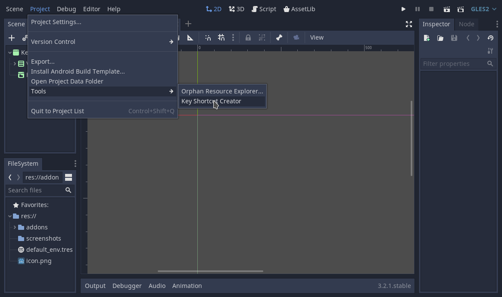
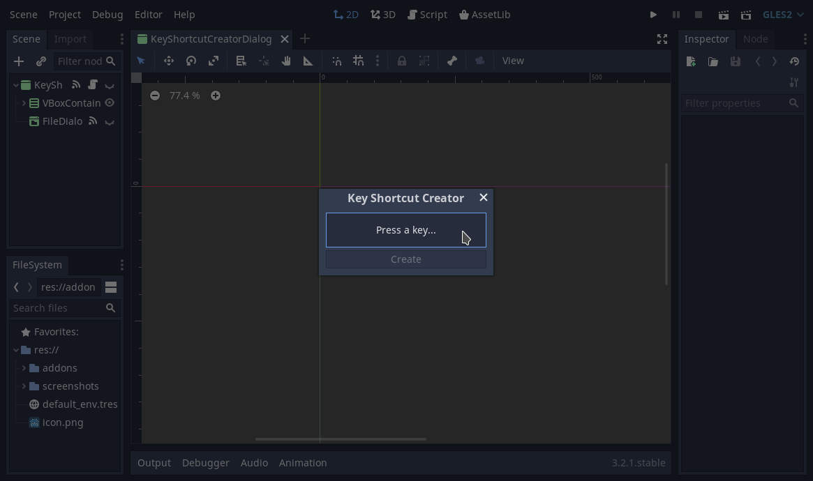
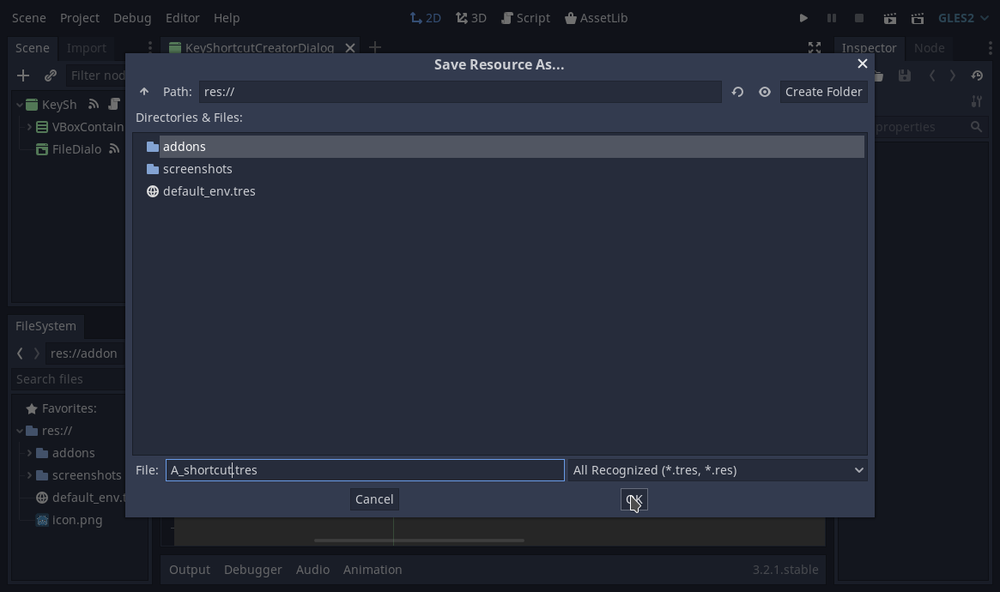
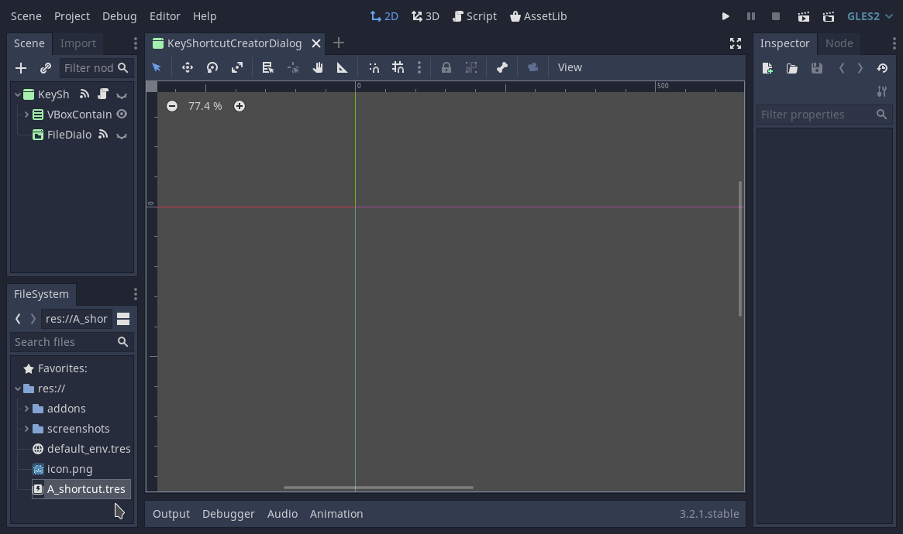

# Key Shortcut Creator
A Godot plugin for creating InputEventKey Shortcut resources with direct keyboard input instead of looking up scancodes manually.

## How to use
Open tool at **Project > Tools > Key Shortcut Creator**

Input the desired keys

Choose Resource path

Done! =D

